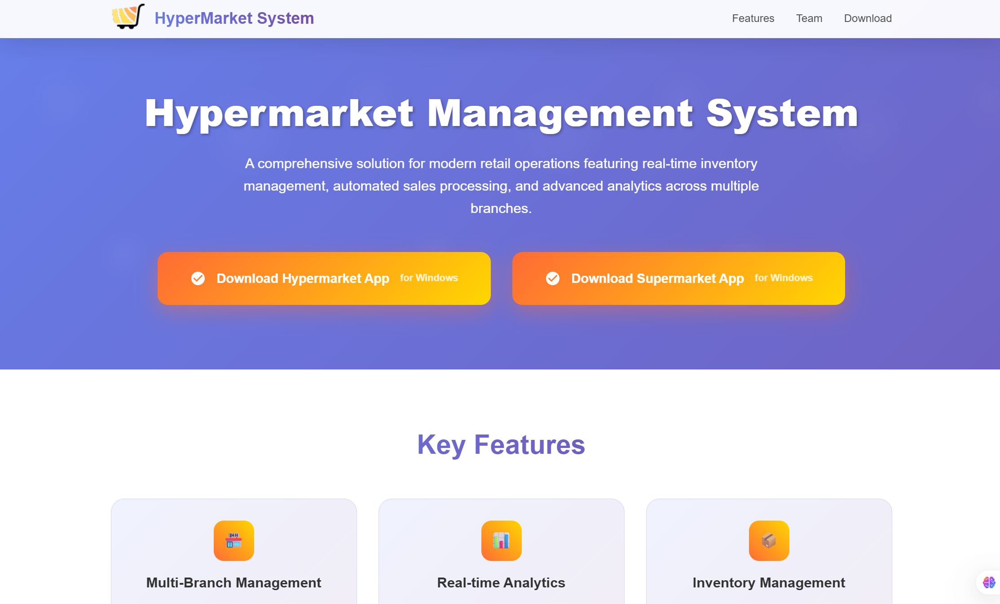

# Hypermarket Management System - Project Website

## Overview

This website serves as the official presentation platform for the **Hypermarket Management System** project developed by a team of computer engineering students at 8 Mai 1945 - Guelma University.

## Purpose

The website showcases our comprehensive retail management solution designed for modern hypermarkets, featuring:

- **Project Introduction**: Complete overview of the hypermarket management system
- **Key Features Display**: Highlighting real-time inventory management, multi-branch operations, and automated sales processing
- **Team Presentation**: Introduction to all six development team members
- **Application Downloads**: Direct access to download both system applications for Windows
- **Academic Information**: University details and project mentorship information

## Target Audience

- **Retail Business Owners** looking for modern management solutions
- **Academic Community** interested in student development projects
- **Technology Enthusiasts** exploring retail automation systems
- **Potential Users** seeking efficient hypermarket management tools

## System Applications Featured

The website provides download access to two main applications:

1. **Hypermarket Management App** - Complete administrative and management interface
2. **Supermarket Management App** - Specialized branch-level operations interface

Both applications are designed for Windows operating systems and offer comprehensive retail management capabilities including inventory tracking, sales processing, user management, and advanced reporting features.

## Project Context

This website represents the digital front-end for our academic project developed during the 2024/2025 academic year under the supervision of **HANNOUSSE Abdelhakim** at the Faculty of Mathematics, Computer Science and Sciences of Matter.

## Screenshots

*Screenshot placeholders - Add your website screenshots here*

---

## Development Team

- DJEGHBAL Sidali
- BOUTOUATOU Hichem  
- CHERFA Mohammed Akram
- HALITIM Amin
- ZOUAOUI Djasser
- TOUALBIA Taki Eddine

**Mentor**: HANNOUSSE Abdelhakim

---

**Website Built by**: HALITIM Amin

*8 Mai 1945 - Guelma University | Department of Computer Science | 2024/2025*
